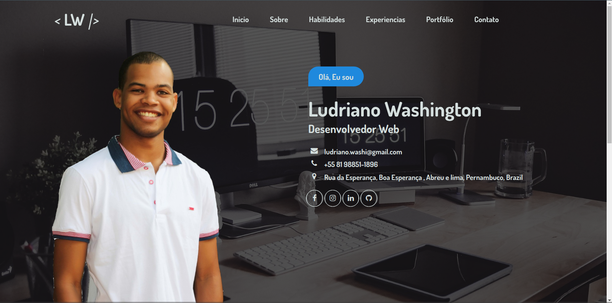

   

# Ludriano - Desenvolvedor Web

#### _Este será o meu Website para visualização de meu portfólio._

Sou Ludriano Washington, tenho 25 anos, atualmente desempregado, tentando recolocão no mercado. Iniciei o curso de Sistemas de Informação em 2015, mas por questões financeiras, fiz o trancamento do curso com pretensão de poder concluí-lo um dia. Neste tempo, crio sistemas, sites e projetos por conta própria para aperfeiçoar as minhas habilidades. 
Atualmente, estou estudando a Stack **_Node.js_**, **_React.js_**, **_React Native_**, mas consigo desenvolver com algumas outras ferrramentas como o **_HTML, CSS3, JavaScript, PHP, Java_**, entre outros.

[Clique aqui](http://ludrianowashington.github.io) para ter acesso ao site.

